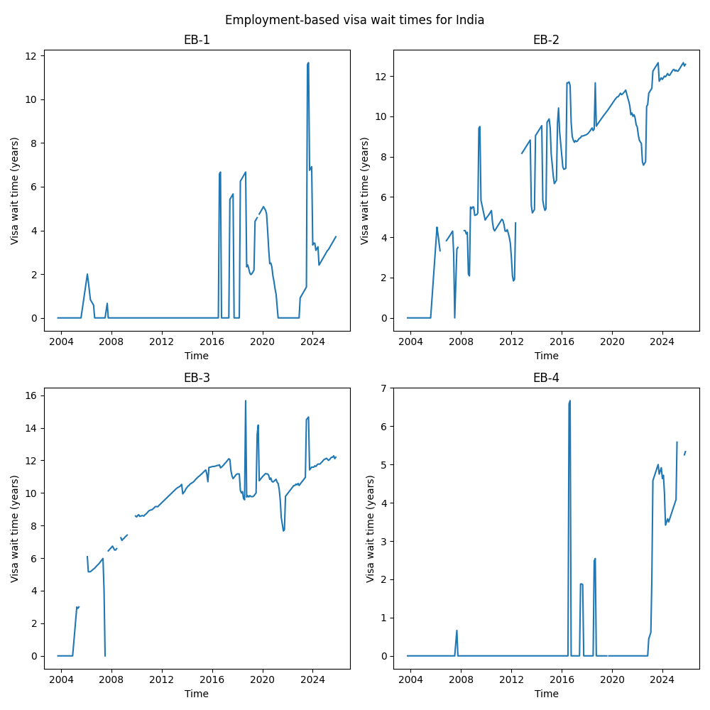
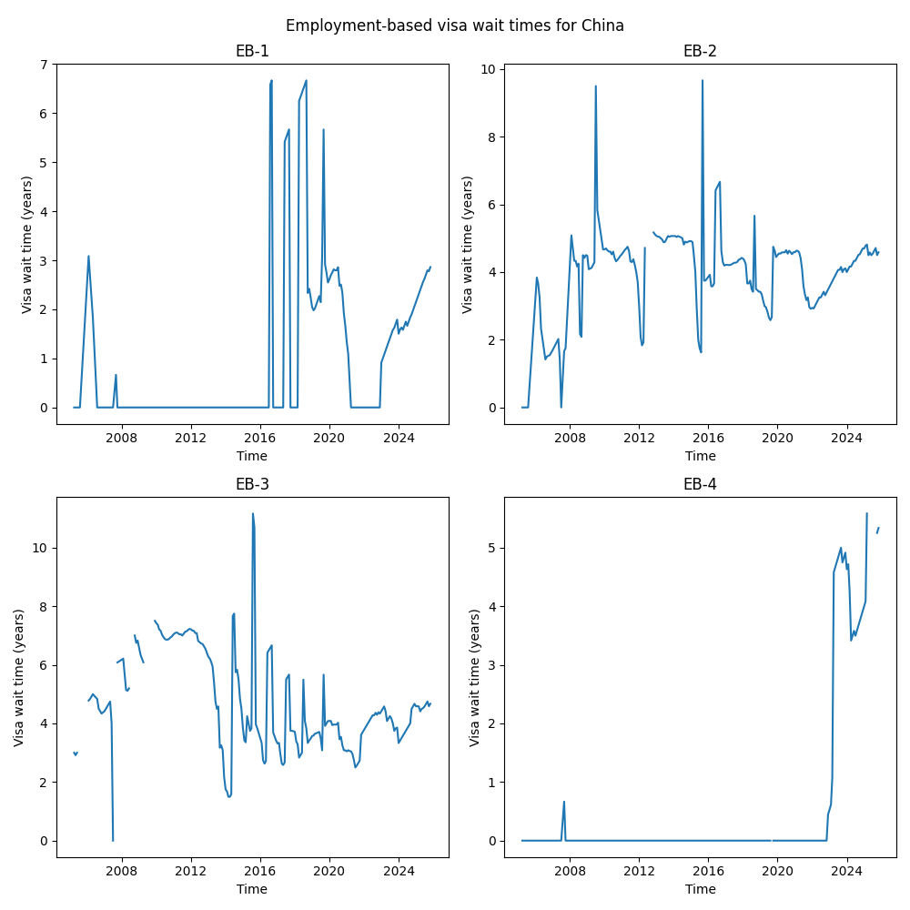
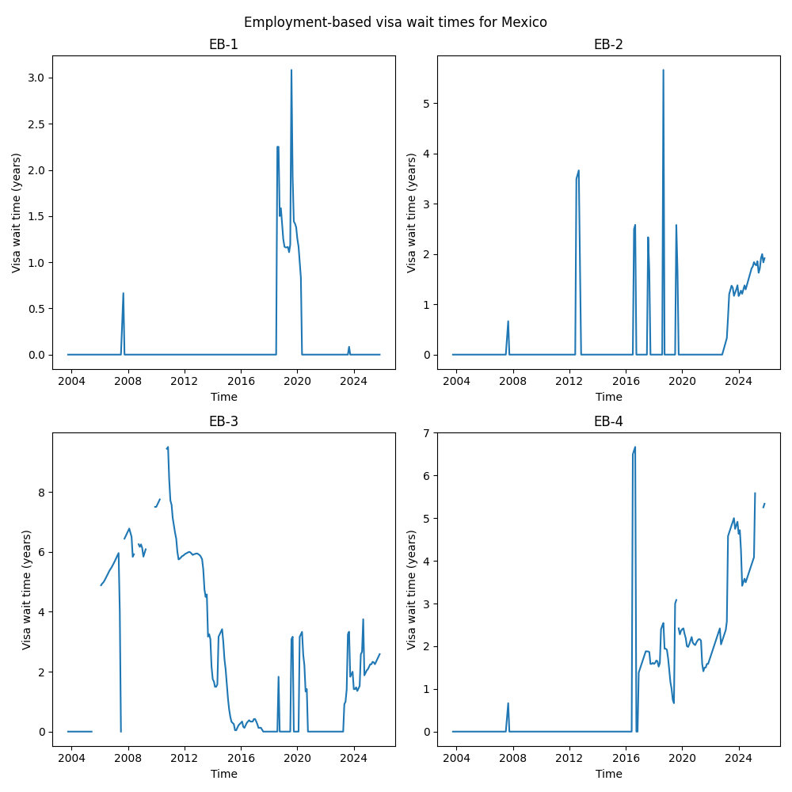
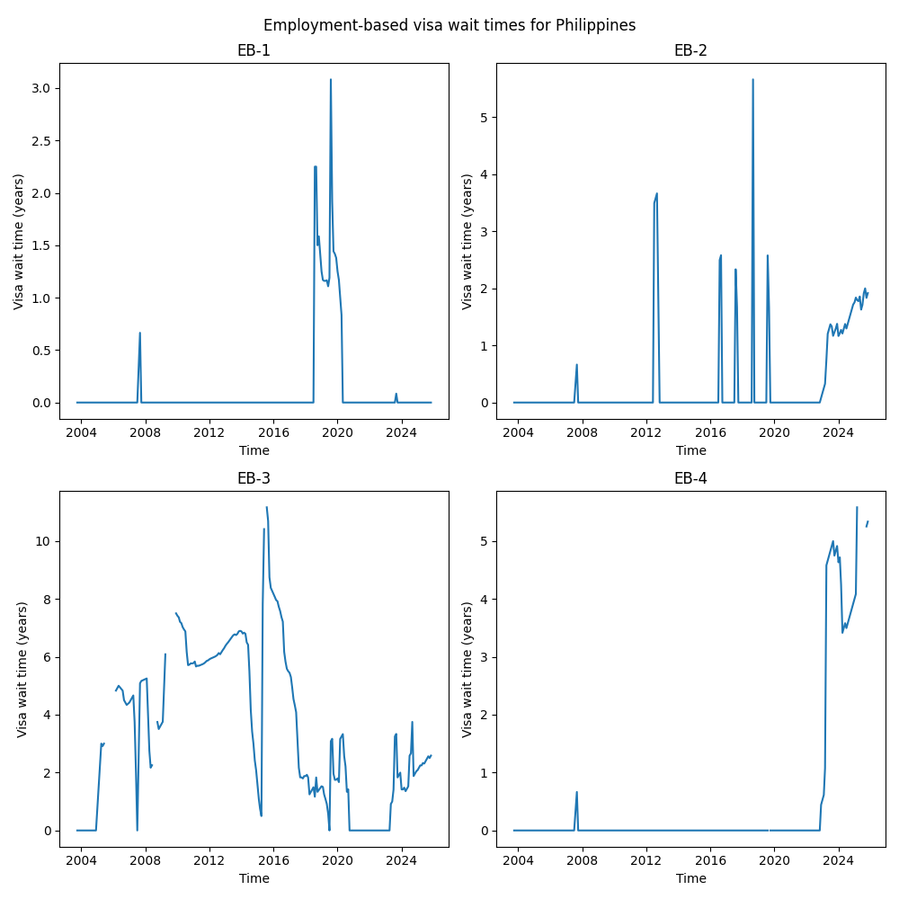

# Visa Bulletin Scraper







This codebase scrapes the employment-based visa bulletin data from the [U.S. Department of State's website](https://travel.state.gov/content/travel/en/legal/visa-law0/visa-bulletin.html) and processes it into a clean CSV file for each country: India, China, Mexico and Philippines, as well as the rest of the world. The scraper script is `scrape_visa_bulletins.py` and the scraped data separated by country is in `data/`.

The scraper is re-run every Sunday at midnight to ensure the data files and figures are always up-to-date. The top of this README has a status badge indicating if the most recent data update succeeded or failed. This provides an aggregated view of historical visa bulletin data in both CSV and visual format for easy consumption as opposed to the outdated PDF aggregations in tabular format on the website. 

## Visualizing visa wait-times
For each specially designated country and the rest of the world, a basic time series visualization of the EB-1 through EB-4 visa wait times can be found in `figures/`. You can also take the `.csv` files from `data/` and upload them to ChatGPT-4 (with the advanced data analysis extension enabled) and ask it to make any figures you want. Good luck!

## Dependencies

The scraper and visualization code require the following Python libraries, which can be installed using pip:

- requests
- pandas
- tqdm
- matplotlib
- beautifulsoup4

In your Python virtual environment, install all dependencies using the following command:

```
pip install -r requirements.txt
```

## How it Works

The script works by first extracting links to monthly visa bulletins from the [main page](https://travel.state.gov/content/travel/en/legal/visa-law0/visa-bulletin.html). Each link is then visited to extract employment-based visa tables (specifically the first occurrence, which contains final action dates). For each country, this tabular data is then cleaned and processed, including converting date strings to datetime objects, calculating the backlog period, and renaming columns for clarity.

## Scraped Data Output

The output is a CSV file named {country}_visa_backlog_timecourse.csv with the following columns:

- EB_level: The employment-based visa level (integers 1, 2, 3, 4).
- final_action_dates: The final action date for the visa.
- visa_bulletin_date: The date of the monthly visa bulletin.
- visa_wait_time: The calculated wait time for the visa *in years*.

## Running the Script

To run the web scraping script, simply execute `scrape_visa_bulletins.py`. The script is designed to be run as a standalone program in about 2 minutes, depending on the speed of your internet connection:

```shell
python scrape_visa_bulletins.py
```

The data populates in `data/`.

To run the visualization script, simply execute the `visualize_visa_wait_times.py` file. 

```shell
python visualize_visa_wait_times.py
```

The figures populate in `figures/`.

## Note

As with any web scraping, this script is designed specifically for the U.S. Department of State website's HTML structure as of the time of writing (Sep. 24, 2023). If the website structure changes in the future, the script may need to be updated.
